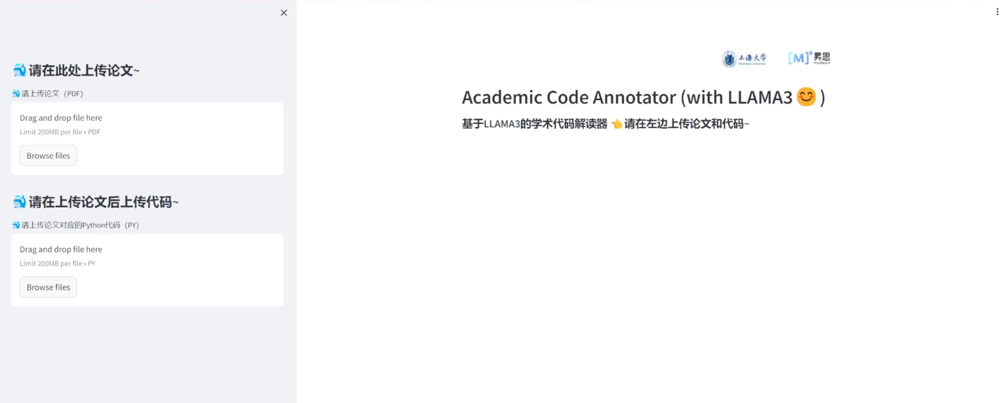
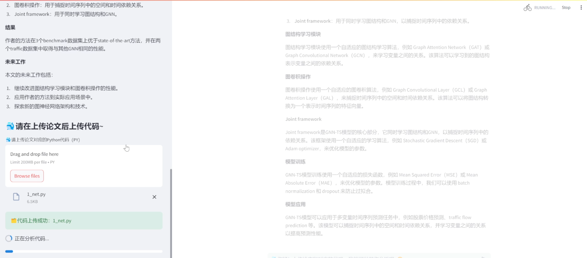
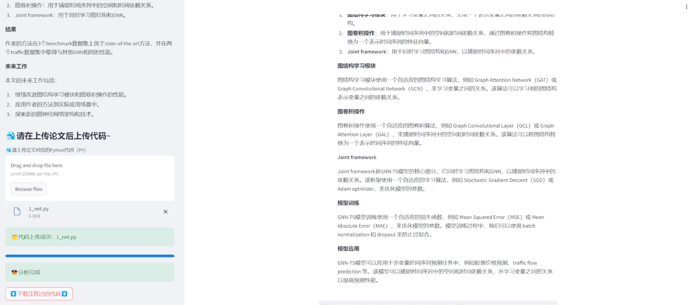

# Academic Code Annotator


Academic Code Annotator 基于LLAMA3的学术代码解读器。上传pdf格式的论文和python文件，根据论文的内容自动注释代码并导出。

# 快速开始：

- 学术代码解读：
```shell
streamlit run web_aca.py /path/to/model
```

- 仅聊天
```shell
streamlit run web_chat.py /path/to/model
```

## 目录结构：

|- files: 基础文件
|- tmp: 临时目录，用于上传下载文件
|- utils: 工具包
    |- PDFplumber: PDF文件读取算法
    |- base_function.py: 基础功能
|- web_aca.py: Academic Code Annotator (with LLAMA3)
|- web_chat.py: 基础聊天页面(with LLAMA3)

## 运行结果：
1. 文献分析：



2. 代码上传：




3. 代码下载：


